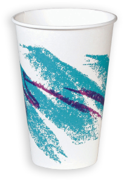

# JSON Color Schemes

Color schemes that give every level of JSON nesting its own color, so you can see at a
glance which level a piece of content belongs to. Five schemes are included:

- **Monokai JSON** — the Monokai palette, with depth colors layered on top
- **Monokai Chalk JSON** — a more pastel palette, with all ten levels actually distinct
- **Monokai Neon JSON** — Monokai's accent colors at full strength
- **Monokai Neue JSON** — inspired by Monokai Neue, with its six-color cycle
- **Jazz Solo Cup JSON** — the teal and purple of the 1990s Jazz cup design

Depth counts objects and arrays alike, so a key nested inside two arrays and an object
gets the same color as one nested four objects deep. It is aimed at the kind of document
that nests past what you can hold in your head; OpenAPI specifications, package lockfiles,
cloud config, API captures, etc.

## Monokai JSON

Built on **Monokai**, the palette by Wimer Hazenberg that Sublime Text still ships as one
of its five default color schemes. The base palette stays intact; the depth colors are
layered on top, so everything outside JSON still looks like the Monokai you already know.

This is the original version of the idea: take the palette everyone recognizes and use it
to give JSON's nesting some visual structure.

| Objects | Arrays | Mixed |
|---|---|---|
|  |  |  |

## Monokai Chalk JSON

This is the one I use. It's also my favorite.

Monokai JSON came first, and it carried a minor flaw: four of its ten levels are
near-duplicates of each other. You don't really notice it in a small file. You notice it
five or six levels down, which is exactly where you need the colors to be doing the
most work.

Chalk uses a soft, pastel feel near the surface, but fixes the repetition. Every level
gets a color that is distinct enough to recognize, and the deep end gets a purple, a pink,
and a teal of its own. Open a spec that nests ten levels deep and the shape starts to
resolve at a glance.

The name comes from the palette's pastel, almost chalky colors.

| Objects | Arrays | Mixed |
|---|---|---|
|  |  |  |

## Monokai Neon JSON

The same Monokai base, with the depth ramp turned all the way up.

Neon uses Monokai's accent colors at full strength. Levels 1 to 7 are literally the
foreground and the colors Monokai gives to keywords, parameters, strings, functions,
types, and constants. Monokai only has seven, so levels 8 to 10 are extensions chosen to
stay as distinct as possible from everything above them.

Every pair of levels is at least dE 20 apart in CIELAB, so even ten levels down, the
colors are designed to remain easy to tell apart.

This one is for when you don't want your nesting to whisper. You want it to make itself
known.

| Objects | Arrays | Mixed |
|---|---|---|
|  |  |  |

## Monokai Neue JSON

A JSON version of **Monokai Neue** by Josh Kaplan, with its darker background and its own
set of accents. The depth ramp uses six of Neue's accent colors on a six-level cycle, kept
exactly as he wrote it. The base is the same: all 152 syntax rules, so everything outside
JSON still looks like the Neue you may already have installed.

The original Neue highlighting colored object keys, and only object keys. This version
extends that idea to string values, array elements, numbers, and booleans, colors arrays
as well as objects, and carries the cycle past level 10.

| Objects | Arrays | Mixed |
|---|---|---|
|  |  |  |

## Jazz Solo Cup JSON

If you were alive in the 1990s and ever drank something from a disposable cup, there is a
decent chance you've seen this design.

**Jazz** was Sweetheart Cup Company's wonderfully loud teal-and-purple pattern: a jagged
teal brush stroke with a purple zig-zag floating above it. It was on cups, plates, bowls,
and basically anywhere a perfectly respectable beverage or serving of nachos could be
accompanied by an unnecessary amount of neon.



And then, somehow, the pattern escaped.

It became one of those oddly specific pieces of 1990s visual culture that people started
recognizing everywhere decades later. There are sightings blogs. Tattoos. Custom sneakers.
A minor-league baseball jersey. The internet, having apparently decided that disposable
tableware deserved a nostalgia revival, did the rest.

So naturally, I made it a JSON color scheme. The palette borrows the same teal-and-purple
pairing.

If Monokai JSON is for people who want their JSON to look like a terminal, Jazz Solo Cup
JSON is for people who want their JSON to look like it just came back from a 1994 birthday
party.

| Objects | Arrays | Mixed |
|---|---|---|
|  |  |  |

The `samples/` folder holds the JSON used for these shots, if you want to compare.

## Requirements

**Sublime Text 4.** The depth coloring relies on scope names that ST4's JSON syntax
produces; on ST3 and earlier you would get the base palette with no depth coloring.
Verified on builds 4200 and 4215.

## Install

**Package Control** — *Preferences → Package Control → Install Package*, then **JSON Color
Schemes**. Pick a scheme under *Preferences → Select Color Scheme…*

**Manually** — copy the five `.sublime-color-scheme` files into a folder under `Packages`
(*Preferences → Browse Packages…*), then pick one under *Select Color Scheme…*

These are complete color schemes, not JSON-only ones, so there's no need for a per-syntax
override.

## Customizing

Every depth color is a variable at the top of each file, so recoloring a level is a
one-line change:

```jsonc
"json_level1": "#FFFFFF",
"json_level2": "#FFFFAA",
```

You don't have to edit the package to do it. Sublime merges color schemes that share a
filename, with `Packages/User` winning, so you can override just the colors you care about
and leave everything else alone. Create `Packages/User/Monokai JSON.sublime-color-scheme`:

```jsonc
{
	"variables":
	{
		"json_level2": "#7FDBCA",
		"json_level3": "#C792EA",
	},
}
```

Your overrides survive package updates. The same trick works for any variable in the file,
not just the depth colors.

Levels 1–10 use the palette, then it cycles: level 11 reuses `json_level1`, up to level 20.
Anything deeper than 20 keeps the level 20 color.

## How it works

Sublime Text 4's JSON syntax stacks one scope per level of nesting:
`meta.mapping.value.json` inside objects, `meta.sequence.json` inside arrays. A bare
`meta` selector atom matches either, so a run of N `meta` atoms means "nested at least N
deep".

That alone leaves every shallower rule also matching a deep token: at a level-10 key, all
ten rules match. Sublime does appear to paint the most deeply nested of them, and it does
so regardless of the order they appear in the file. But that behavior is not documented,
and a scheme that depends on it is one Sublime release away from the breakage that started
all this.

So each rule is instead made mutually exclusive with the `-` operator: level N means "at
least N deep" AND NOT "at least N+1 deep".

```jsonc
// level 1 object key
"scope": "source.json meta.mapping.key string - meta meta.mapping.key",
// level 2 object key
"scope": "source.json meta meta.mapping.key string - meta meta meta.mapping.key",
```

Exactly one rule can match any given token, so ranking never gets a vote at all. Object
keys, string values and array elements, numbers, and `true`/`false`/`null` are each
covered at 20 levels.

There is no way to write "either a mapping value or a sequence" inside a descendant chain:
`(a|b)` in that position doesn't do what it looks like. That is why the older ST2/ST3
versions of these schemes had to enumerate every one of the 2ᴺ nesting paths, and why they
were about 1 MB and 1,563 rules each. These are 26 KB and 107 rules.

## Going further

**You don't need any of this to change colors.** Recoloring a level is a one-line variable
edit, see [Customizing](#customizing) above. Everything below is for changing how the
schemes are built.

The generator ships with the package, so you already have it: look in `Packages/JSON Color
Schemes/dev/` (*Preferences → Browse Packages…*), or clone the repo. Generating and
checking the schemes is plain Python 3 with no dependencies; only the optional screenshot
check needs Pillow.

### Change the palette

Both palettes sit at the top of `dev/build.py`, as `MONOKAI_LEVELS` and `JAZZ_LEVELS`.
Edit them and regenerate:

```
cd dev
python build.py
```

For a one-off recolor, prefer the `Packages/User` override described above, it survives
package updates. Editing the palette here is for building your own scheme to keep or
share.

### Change the structure

`dev/depth_selectors.py` holds the two numbers that shape everything:

```python
PALETTE_SIZE = 10   # colors before the palette repeats
MAX_LEVEL = 20      # deepest level given its own rule
```

Raise `MAX_LEVEL` if you routinely nest deeper than 20, or change `PALETTE_SIZE` to match
a longer palette. This is also where you would add a new token kind; coloring braces and
brackets per level, for instance, needs a fifth selector builder alongside the four in
`BUILDERS`, plus a label in `KIND_LABEL` in `dev/build.py`.

Don't edit the `.sublime-color-scheme` files directly; `build.py` overwrites them.

### Check it still works after a Sublime update

The depth coloring depends on scope names that ST4's JSON syntax produces. A change there
is exactly what broke the ST2/ST3 versions of these schemes, so if an update ever leaves
your JSON looking flat or miscolored:

```
cd dev
python verify.py
```

If it **fails**, it names the level and token kind that broke. If it **passes**, the
selectors are still sound and Sublime's JSON syntax has moved underneath them. Run *Tools
→ Developer → Show Scope Name* on a deeply nested key and compare what you get against
`dev/fixtures/st4-scope-stacks.json`.

It checks that exactly one rule matches any given token, that it is the rule for the right
level, and that no rule bleeds across token kinds: 8,980 synthetic cases covering every
object/array nesting permutation to depth 8 plus representative shapes beyond, and the 28
real scope stacks in `dev/fixtures/` captured from ST4 build 4200. The matcher it uses was
cross-checked against Sublime's own `sublime.score_selector()` over 1,920 comparisons with
no disagreements.

There is also `dev/verify_screenshots.py`, which reads each palette out of the generated
scheme file and checks the screenshots pixel by pixel, so an image that drifts out of date
gets caught. It is the only thing here with a dependency: `pip install pillow`.

## Why these exist

I've spent way too much time drafting and editing OpenAPI specs. The kind where you open a
response schema, follow `properties` into another object, find an `allOf`, fall into a few
more levels of nesting, and eventually realize you're spending as much effort keeping
track of the structure as you are reading the content. By the time you reach something as
ordinary as a field's `type`, you are typically eleven levels deep.

In a single flat color, reading a spec like that means counting braces and matching
indentation to work out which object you are actually looking at. I got tired of counting
braces. Giving each level of nesting its own color turns that into something you can just
see: content that shares a color shares a level.

When the structure gets that deep, indentation only gets you so far. I wanted something
that made the hierarchy visible without having to mentally trace it.

So I wrote **Monokai JSON** for Sublime Text 2, then added **Jazz Solo Cup** for Sublime
Text 3. Both stopped working on Sublime Text 4, whose rewritten JSON syntax replaced the
`meta.structure.dictionary.json` scopes the old rules targeted. Every JSON file went back
to being one flat color. This project is the port. The palettes are the originals,
recovered from the old `.tmTheme` files by recomputing each rule's depth from its
selector.

That depth is also why this version runs to 20 levels and cycles rather than stopping at 10.
The old cap was a consequence of how the schemes had to be built, not a decision, and
it ran out of colors one level short of where an OpenAPI spec puts a field's type.

## Credits

Monokai JSON is derived from the Monokai palette by Wimer Hazenberg.

Monokai Neue JSON is derived from Monokai Neue by Josh Kaplan.

Jazz Solo Cup JSON borrows the colors of the *Jazz* cup design, created at Sweetheart Cup
Company and introduced in 1992.

## License

Copyright (C) 2026 [Lance Duvall](https://github.com/lanz).

Licensed under the [GNU Affero General Public License v3.0](LICENSE) or later.
